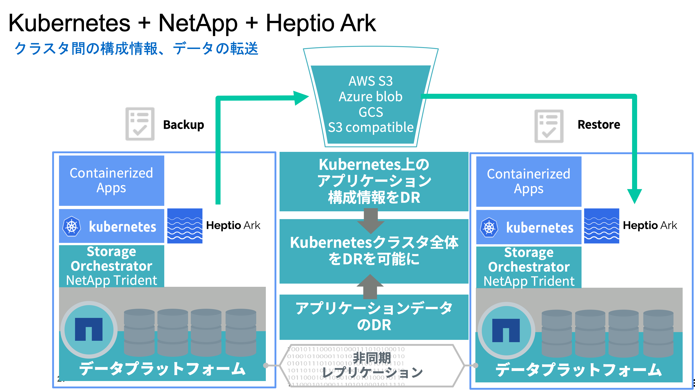

## Trident のバックエンドストレージに設定したONTAPでの使い方

ストレージ機能としてストレージ全体を遠隔地にレプリケーションする機能があります。(SVM-DR)

ここでは Heptio ark をつかい、kubernetesの構成情報をバックアップ/リストアし、
実データをSVM-DRを用いデータ転送後、別Kubernetes環境でリストアする方法について説明します。

### Heptio Ark

Heptio 社が提供しているkubernetesのデファクトバックアップ・リストアツールです。

- https://github.com/heptio/ark

heptio ark を使うことでクラスタ全体やLabelで指定したkubernetesオブジェクトをバックアップすることができます。

取得したバックアップを使用することで以下のようなことが実現可能です。

- kubernetes クラスタのバックアップ、DR
- 本番環境のクラスタから開発環境へ構成情報をリストア
- クラスタの引っ越し

現在(2018/10)のバージョンではボリュームのレプリケーションはサポートされていないため、別の手段でバックアップ・リストアをする必要があります。

### アプリケーションデータのレプリケーション

アプリケーションデータのバックアップ・DRはストレージレイヤーのレプリケーション機能で実現します。

NetAppではデータレプリケーションの方法としては以下の３つの方法があります。

1. SnapMirror: ボリューム単位のデータレプリケーション、ブロック差分転送が可能
1. SVMDR: 仮想ストレージ単位のデータレプリケーション、ブロック差分転送が可能、かつストレージ情報(アカウントやデータ通信用のIPなど)を維持した状態で転送
1. CloudSync: SaaSのデータ同期ツール、ファイル単位の差分転送が可能

今回はSVMDRを使用して実現しました。

#### SVMDRを選択した理由

Heptio Ark を使用して取得するバックアップにバックエンドストレージのIPや構成情報が含まれている状態でバックアップされます。
そこから復元を行うと、ストレージレイヤの構成情報が変更になると正常に稼働しなくなるため、仮想ストレージ単位ですべてを転送する仕組みを提供できるSVMDARを選択しました。

### 実際の構成

#### Heptio Ark

#### NetApp ONTAP

